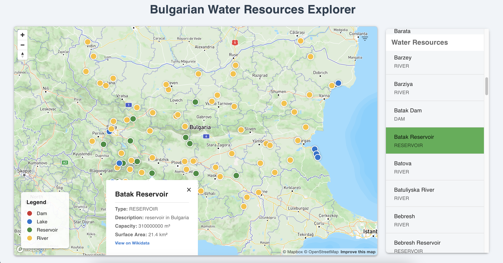

# Bulgarian Waters - Graph Databases Final Project

## Project Overview

### Goals  
The Bulgarian Waters project aims to provide an interactive platform for exploring, visualizing, and analyzing Bulgaria’s water resources. It combines a graph database backend with a React frontend to allow users to efficiently query and navigate detailed information about rivers, dams, lakes, and reservoirs across Bulgaria.

### Data Used  
Water resource data is sourced from WikiData and includes geographical coordinates, descriptions, types, capacities, surface areas, and other relevant attributes. The data is modeled as a graph and served via a GraphQL API.

### Methods Applied  
- **GraphQL API** for flexible and optimized querying of water resource data.  
- **Redis caching** to improve response times and reduce backend load.  
- **React frontend** using Mapbox GL for interactive map visualization.  
- **Material-UI** for a responsive and user-friendly interface with filtering and search capabilities.

### Results  
- A responsive, easy-to-use web application showcasing Bulgaria’s water resources on an interactive map.  
- Efficient backend queries enabled by GraphQL and caching.  
- Extensible architecture ready for future enhancements and additional data integration.

---

## Features

- **GraphQL API**: Query water resources by type, capacity, surface area, etc.
- **Caching**: Caching implemented using Redis to reduce load times.
- **Pagination**: Supports pagination of results.

---

## Frontend Application

The frontend of Bulgarian Waters is a React-based web application designed to provide an interactive and user-friendly way to explore Bulgaria's water resources on a map.

### Key Features:

- **Interactive Map Visualization**:  
  The main component, `WaterMap`, uses Mapbox GL via `react-map-gl` to display water resources as markers on a map of Bulgaria. Users can pan, zoom, and click markers to get detailed information.

- **GraphQL Integration with Apollo Client**:  
  The React app is wrapped with `ApolloProvider`, using a configured Apollo Client instance to query the backend GraphQL API for water resource data. Queries support filtering by type (river, dam, lake, reservoir), minimum capacity, and surface area.

- **Filtering & Search**:  
  Users can filter water resources by type, minimum capacity (in cubic meters), and minimum surface area (in square kilometers). Filters debounce input to optimize API calls, and users can reset or close the filter panel easily.

- **Responsive UI with Material-UI**:  
  The interface leverages Material-UI (`@mui/material`) components for styling, layout, and controls, providing a clean, accessible, and responsive user experience.



---

## Getting Started

This project consists of three main components:
- **Frontend** (React client)
- **Backend** (GraphQL API server)
- **Redis** (for caching)

### Prerequisites

Make sure you have the following installed on your machine:

- [Docker](https://docs.docker.com/get-docker/)
- [Docker Compose](https://docs.docker.com/compose/install/)

### Running the Project Locally

1. **Clone the repository:**

   ```bash
   git clone https://github.com/baczewski/BulgarianWaters.git
   cd BulgarianWaters
   ```

2. **Start the services using Docker Compose:**

   Run the following command in the root folder where `docker-compose.yml` is located:

   ```bash
   docker-compose up --build
   ```

   This will build and start three containers:

   - **backend** (GraphQL API) on port `4000`
   - **frontend** (React app) on port `3000`
   - **redis** (caching) on port `6379`

3. **Access the application:**

   - Frontend UI: [http://localhost:3000](http://localhost:3000)
   - GraphQL Playground: [http://localhost:4000/graphql](http://localhost:4000/graphql)

4. **Example GraphQL queries:**

   You can use the GraphQL playground to try queries like these:

   ```graphql
   query {
     waterResources(limit: 5, type: RIVER, minCapacity: 1000) {
       id
       name
       type
       capacity
       surfaceArea
       description
       coordinates {
         latitude
         longitude
       }
     }
   }
   ```

   Or to fetch a specific water resource by ID:

   ```graphql
   query {
     waterResource(id: "123") {
       id
       name
       type
       capacity
       surfaceArea
       description
       coordinates {
         latitude
         longitude
       }
     }
   }
   ```

### Additional Commands

- To run the services in detached mode (in the background):

  ```bash
  docker-compose up -d --build
  ```

- To stop and remove all containers:

  ```bash
  docker-compose down
  ```

- To view logs of a specific service (e.g., backend):

  ```bash
  docker-compose logs -f backend
  ```

---

Feel free to explore and extend the API queries as needed!
